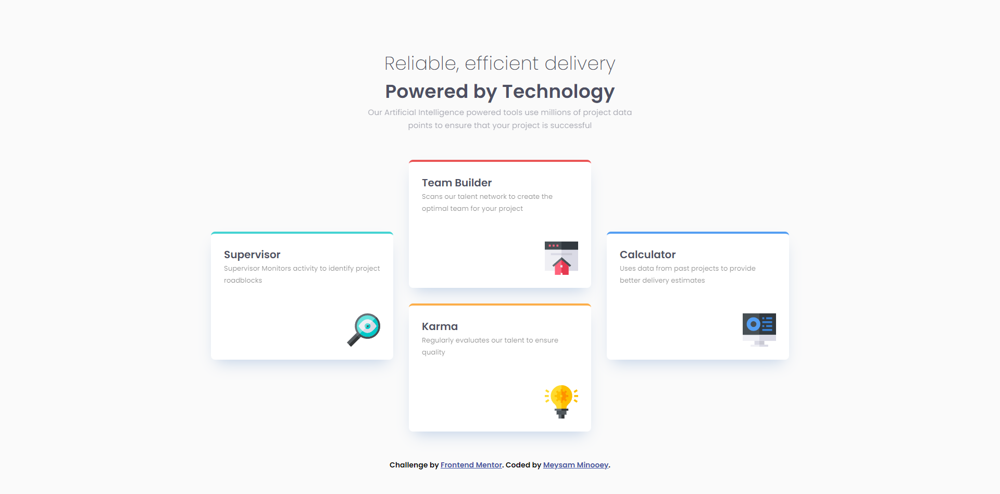

# Frontend Mentor - Four card feature section solution

### The challenge

Users should be able to:

- View the optimal layout for the site depending on their device's screen size

### Screenshot

### Links

- Solution URL: [Solution URL](https://github.com/meysamminoo/Four-card-feature-section)
- Live Site URL: [Live site URL](https://meysamminoo.github.io/Four-card-feature-section/)

### Built with

- Semantic HTML5 markup
- CSS custom properties
- Flexbox

### What I learned

Use this section to recap over some of your major learnings while working through this project. Writing these out and providing code samples of areas you want to highlight is a great way to reinforce your own knowledge.
